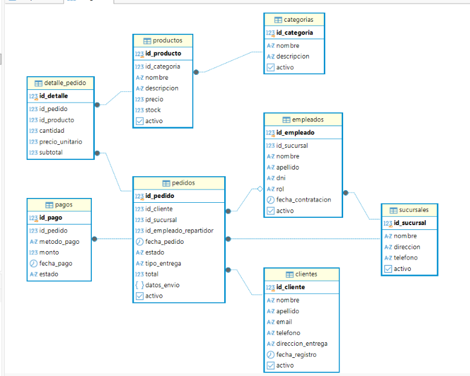

# Food Store — Sistema de Gestión y Base de Datos Relacional

Este repositorio contiene la solución completa de Base de Datos para la plataforma Food Store, correspondiente al Trabajo Práctico Integrador de Base de Datos II.

Incluye la arquitectura DDL, objetos programables (vistas, funciones, disparadores y procedimientos en PL/pgSQL), consultas analíticas avanzadas y pruebas de control transaccional ACID.

---

## Diagrama Entidad-Relación (ERD)



---

## Estructura del Repositorio

```text
food-store/
├── sql/
│   ├── 01_ddl_esquema.sql            # Creación de tipos ENUM, tablas, claves e índices
│   ├── 02_objetos_programables.sql  # Vistas, funciones, triggers y sp_crear_pedido
│   ├── 03_consultas_analiticas.sql   # Consultas analíticas, JOINs, subconsultas y ventanas
│   └── 04_transacciones.sql          # Pruebas ACID (BEGIN, COMMIT, ROLLBACK)
├── imagenes/
│   └── diagrama_erd.png              # Captura del diagrama de la base de datos
├── informe.md                         # Informe técnico de implementación
└── README.md                          # Presentación e instrucciones de uso
