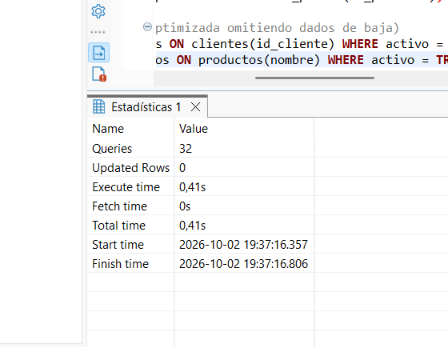
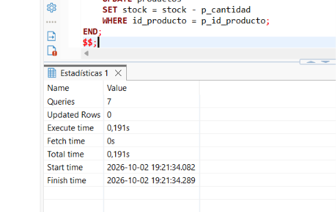
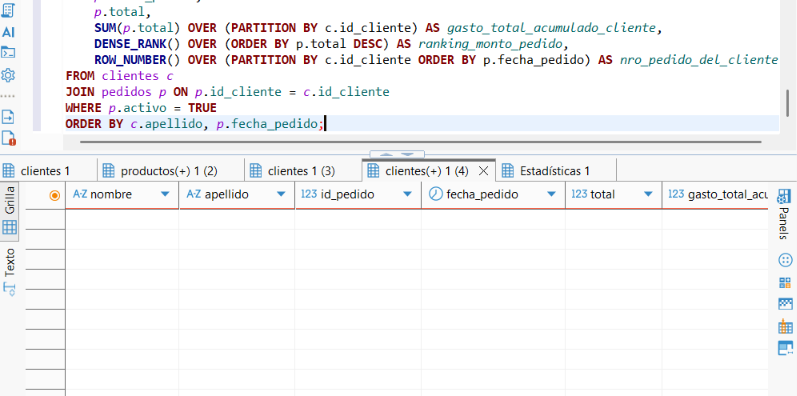
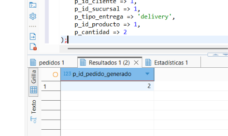

# Informe Técnico de Implementación — Food Store

## 1. Introducción y Alcance
Este documento presenta la documentación técnica del sistema de base de datos relacional para la plataforma **Food Store**, correspondiente al Trabajo Práctico Integrador de Base de Datos II. Se detalla la estructura DDL, la lógica ejecutable (vistas, funciones, triggers y procedimientos almacenados), las consultas de reportería analítica y el control transaccional ACID.

---

## 2. Descripción de la Estructura (DDL)
La base de datos se encuentra normalizada en Tercera Forma Normal (3FN) y está compuesta por 8 tablas principales:
- `categorias`: Clasificación de productos.
- `productos`: Catálogo de artículos con control de stock y borrado lógico.
- `clientes`: Registro de usuarios y datos de entrega.
- `sucursales`: Puntos de venta y distribución.
- `empleados`: Personal asignado a sucursales y repartidores.
- `pedidos`: Encabezado de transacciones comerciales.
- `detalle_pedido`: Desglose de cada producto dentro de un pedido.
- `pagos`: Registro de transacciones monetarias y sus estados.

---

## 3. Evidencias de Ejecución y Pruebas

A continuación se presentan las capturas de pantalla que verifican el correcto despliegue y funcionamiento del sistema en PostgreSQL a través de DBeaver:

### 3.1. Creación e Instalación del Esquema DDL
Ejecución del script `01_ddl_esquema.sql` con la creación de tipos ENUM, tablas, claves primarias/foráneas e índices.

### 3.2. Objetos Programables
Ejecución del script `02_objetos_programables.sql` incluyendo vistas, la función de ticket promedio, el trigger de cálculo automático y el procedimiento almacenado `sp_crear_pedido`.

### 3.3. Consultas Analíticas y Reportes
Ejecución del script `03_consultas_analiticas.sql` que abarca consultas de reportería, filtros agrupados, JOINs y funciones de ventana.

### 3.4. Control Transaccional ACID y Procedimiento Almacenado
Ejecución del script `04_transacciones.sql` con las pruebas de integridad atómica (`COMMIT` y `ROLLBACK`) y la creación asistida de pedidos.

---

## 4. Diagrama Entidad-Relación (ERD)

Representación gráfica de las 8 tablas interconectadas y sus relaciones de clave foránea en DBeaver:

---

## 5. Conclusión
La base de datos de Food Store cumple con todos los requisitos funcionales y no funcionales solicitados, garantizando la integridad referencial, la automatización de procesos mediante lógica programable y un control de transacciones robusto.
